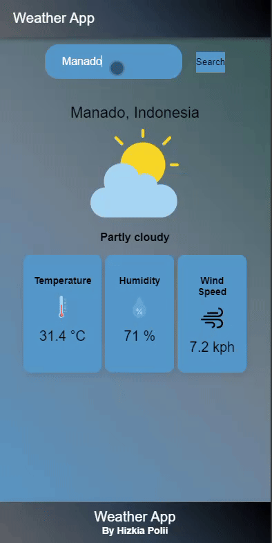

<h1>Weather_App-Hizkia_Polii-IONIC</h1>

</img>

Weather app adalah aplikasi yang dirancang menggunakan framework IONIC. Aplikasi ini menyediakan informasi cuaca terkini, termasuk suhu, kelembapan, kecepatan angin, dan prakiraan cuaca untuk berbagai lokasi.

<h1>PREVIEW</h1>

</img>

<h1>LINK GOOGLE DRIVE</h1>
<a href="https://drive.google.com/file/d/1ydDfh4VsPNbg5BtV6DEj-TAFvijN6YhT/view?usp=sharing">Pencet Disini</a>

<h1>FITUR APLIKASI</h1>

- Aplikasi ini menyediakan informasi cuaca terkini untuk berbagai lokasi, termasuk suhu, kelembapan, kecepatan angin, dan tekanan atmosfer.
- Informasi cuaca mencakup hampir semua elemen cuaca yang relevan, memberikan gambaran lengkap tentang kondisi cuaca di lokasi pengguna.

<h1>PENGINSTALLAN</h1>

1.  Lakukan Clone Repository
    `git clone hhttps://github.com/HizkiaPolii/Weather_App-Hizkia_Polii-IONIC.git`

2.Masuk ke Direktori Proyek
`cd weather-app`

3. Instal
   `npm install`

4. Jalankan
   `npm start`

Aplikasi akan terbuka di browser default dengan url `http://localhost:8100`.

<h1>PENGGUNAAN APLIKASI</h1>

- Buka Apikasi Weather App
- Cari kota yang ingin kita lihat cuacanya
- Cuaca dari kota yang anda akan muncul
